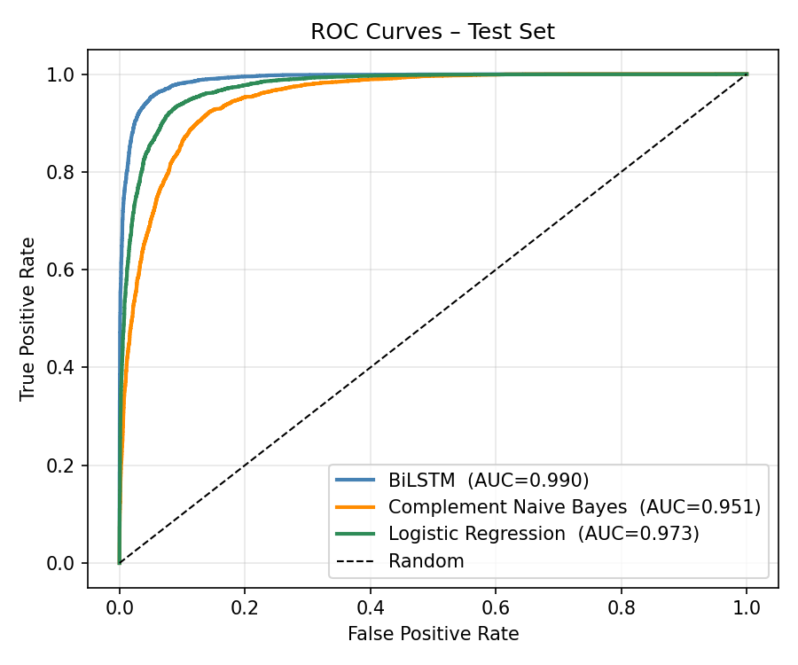
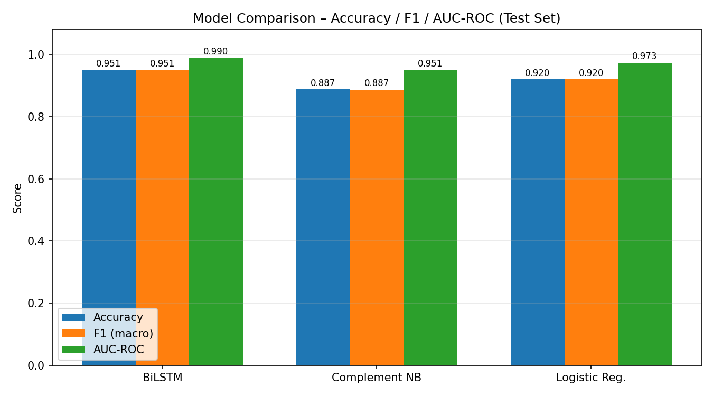
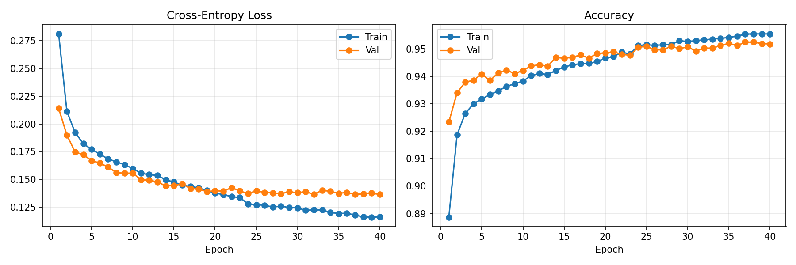
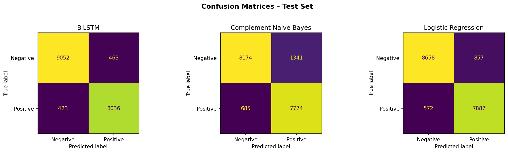

# Clinical NLP — Chest X-Ray Report Classification

**Course:** CM2026 Advanced Machine Learning for Data-Driven Health, KTH Royal Institute of Technology  
**Author:** Mansour Arefi  
**Notebook:** `Chest_XRay_Classification.ipynb`  
**Dataset:** [MIMIC-CXR](https://physionet.org/content/mimic-cxr/2.1.0/) + [CheXpert labels](https://physionet.org/content/mimic-cxr-jpg/)

> ⚠️ Raw data not included — requires PhysioNet credentialed access.

---

## Problem

Radiology reports contain rich clinical language that can be automatically classified to support diagnosis workflows and decision support systems. This project trains a **BiLSTM from scratch** to classify chest X-ray radiology reports as **positive** (finding present) or **negative** (no finding), and benchmarks it against classical NLP baselines.

---

## Results

| Model | Accuracy | F1 (macro) | AUC-ROC |
|---|---|---|---|
| **BiLSTM** | **0.950** | **0.950** | **0.9895** |
| Logistic Regression (TF-IDF) | 0.921 | 0.920 | 0.973 |
| Complement Naive Bayes (TF-IDF) | 0.887 | 0.887 | 0.951 |




---

## Data pipeline

**Source:** MIMIC-CXR radiology reports + CheXpert label file (`mimic-cxr-2.0.0-chexpert.csv`)

**Label engineering:**
- **Positive (1):** at least one CheXpert finding column = 1.0 AND `No Finding ≠ 1.0`
- **Negative (0):** `No Finding = 1.0` AND no positive findings
- Uncertain labels (`-1.0`) discarded

**Sampling:** 65,000 per class (130k total) — balanced, stratified 70/15/15 split

**Text extraction:** IMPRESSION + FINDINGS sections combined — IMPRESSION provides the summary, FINDINGS provides per-region detail

**Preprocessing:**
1. Lowercase
2. Remove PHI placeholders (`___`)
3. Remove numbers and punctuation
4. Remove standard English function words
5. Remove medical boilerplate (words present in almost every report regardless of finding — e.g. `patient`, `lateral`, `examination`)
6. Note: negations (`no`, `not`, `without`, `clear`, `normal`) deliberately **kept** — they carry diagnostic meaning

---

## BiLSTM Architecture

```
Input tokens (max_len=38)
       ↓
Embedding (vocab=3,103, dim=128, padding_idx=0)
       ↓
BiLSTM (hidden=128, num_layers=1, dropout=0.5, bidirectional=True)
       ↓
Last hidden state (forward + backward concatenated → 256-dim)
       ↓
Dropout(0.5) → Linear(256→2)
       ↓
Binary logits
```

**Vocabulary:** 3,103 tokens — medical stopword removal produces a compact, highly discriminative vocabulary from 30k candidates.

---

## Training strategy

| Parameter | Value | Rationale |
|---|---|---|
| Loss | CrossEntropyLoss | Balanced classes — no weighting needed |
| Optimizer | Adam, lr=3e-4, weight_decay=1e-4 | 1e-5 is fine-tuning territory; 3e-4 trains faster from scratch |
| Scheduler | ReduceLROnPlateau (patience=3, factor=0.5) | Adapts when validation plateaus |
| Epochs | 40 (max) | With early stopping patience=5 |
| Batch size | 64 | — |

**Design decisions:**

- **1 LSTM layer (not 2):** second layer added no useful abstraction for sequences averaging 13 tokens — only increased overfitting
- **Hidden dim 128 (not 256):** 256 was over-capacity for short clinical phrases; 128 matched embed dim and trained stably
- **Dropout 0.5 (not 0.3):** higher dropout was necessary at this scale to prevent overfitting on vocabulary patterns



---

## Benchmark models

Both trained on **TF-IDF features** (30k max features, min_df=3, sublinear_tf):

- **Complement Naive Bayes** — fast, interpretable, strong on text; `alpha=0.1`
- **Logistic Regression** — linear baseline with L2 regularisation; `C=1.0`

These establish the performance floor the BiLSTM must meaningfully exceed to justify added complexity. The BiLSTM outperforms both (+2.9 pp accuracy vs LR, +6.3 pp vs NB) and achieves substantially higher AUC.



---

## Load model (without retraining)

```python
import json, torch

with open("output/model_config.json") as f:
    cfg = json.load(f)

model = BiLSTMClassifier(**cfg)
model.load_state_dict(torch.load("output/bilstm_best.pt", map_location="cpu"))
model.eval()

with open("output/vocabulary.json") as f:
    vocabulary = json.load(f)
```

---

## Repository structure

```
clinical-nlp-cxr-report-classification/
├── Chest_XRay_Classification.ipynb     # Full pipeline — run top to bottom
├── requirements.txt                    # Python dependencies
└── output/
    ├── bilstm_best.pt                  # Best model weights (by val accuracy)
    ├── model_config.json               # Architecture config for reloading
    ├── vocabulary.json                 # Token-to-index mapping
    ├── training_curves.png             # Loss and accuracy over epochs
    ├── roc_curves.png                  # ROC curves — all three models
    ├── confusion_matrices.png          # Confusion matrices — test set
    ├── model_comparison.png            # Bar chart: accuracy/F1/AUC comparison
    └── eda_top_words.png               # Top discriminative words per class
```

> Paths in the notebook point to Kaggle (`/kaggle/input/...`). Update Cell 4 if running locally.

---

## Technologies


`python` `pytorch` `bilstm` `nlp` `text-classification` `clinical-nlp` `mimic-cxr` `radiology` `tfidf` `naive-bayes` `kth`
