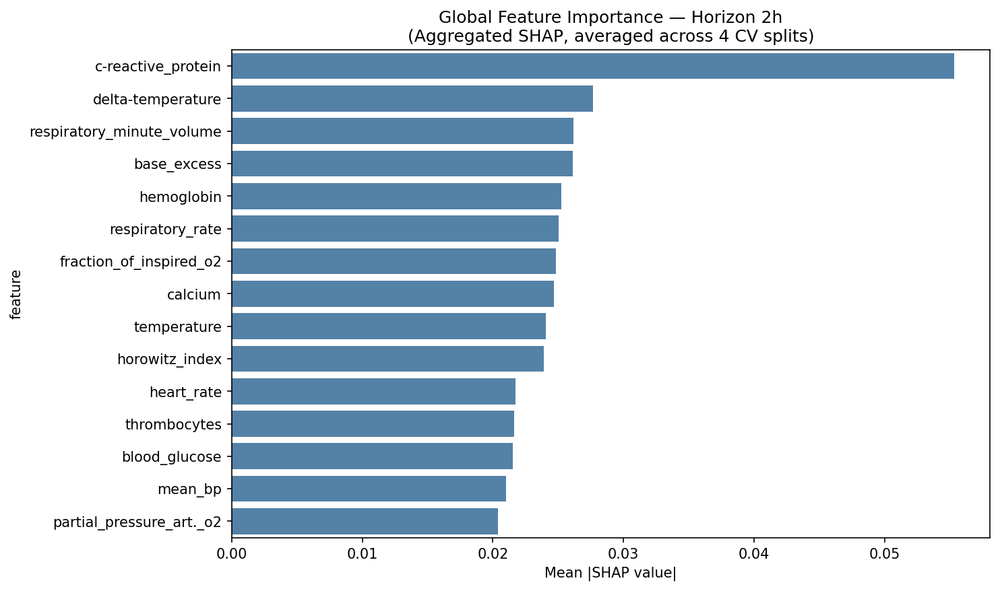
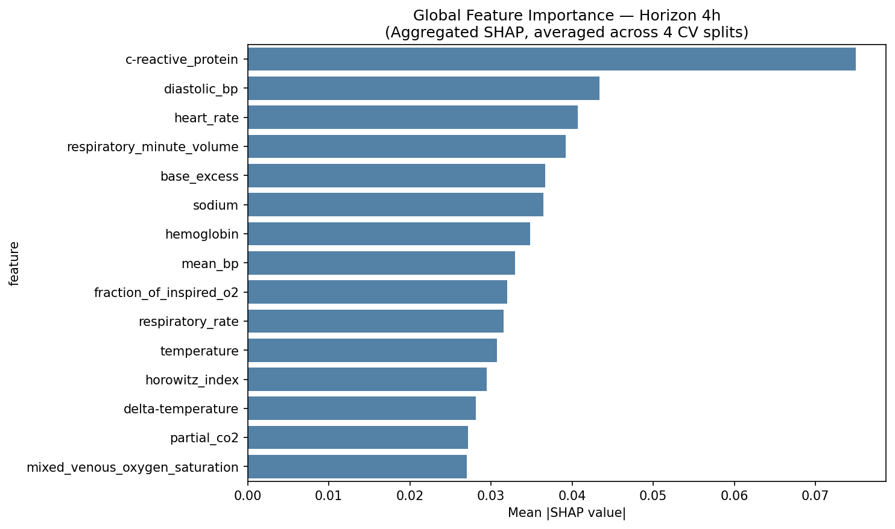
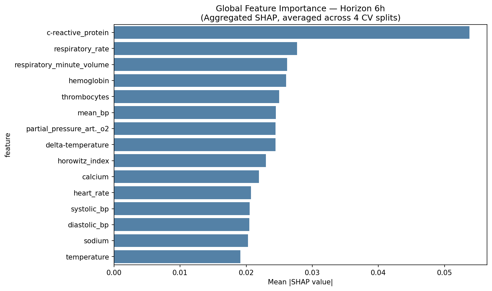

# Sepsis Onset Prediction with GRU Neural Network

**Course:** CM2011 Machine Learning for Health, KTH Royal Institute of Technology  
**Dataset:** [SepsisExp — Heidelberg University](https://www.cl.uni-heidelberg.de/statnlpgroup/sepsisexp/#data)  
**Notebook:** `Mansour_Arefi_Assignment2.ipynb`

---

## Problem

Sepsis is a life-threatening condition with non-specific early symptoms, making timely intervention critical and difficult. This project trains a recurrent neural network to predict sepsis onset **2, 4, and 6 hours in advance** from longitudinal ICU laboratory measurements — giving clinicians an interpretable early warning signal.

---

## Dataset

The **SepsisExp dataset** (Schamoni et al., 2022) contains time-series laboratory measurements from 1,275 ICU patients, pre-partitioned into four equal splits (A–D). Patients with on-admission sepsis or short stays (< 16h) were excluded from the original dataset.

> ⚠️ Raw data not included — download from [cl.uni-heidelberg.de/statnlpgroup/sepsisexp](https://www.cl.uni-heidelberg.de/statnlpgroup/sepsisexp/#data)

---

## Architecture — SepsisGRU

A stacked GRU-based binary classifier implemented in PyTorch:

```
Input: (batch, 24 timesteps, n_features)   ← 12h lookback at 30-min resolution
         ↓
GRU Layer 1  (hidden=64, dropout)
GRU Layer 2  (hidden=64, dropout)
         ↓ last hidden state
Linear → ReLU → Linear
         ↓
Output: binary logit (sepsis within Xh)
```

**Design choices:**
- **GRU over LSTM** — fewer parameters, comparable performance on clinical time-series, less prone to overfitting on limited patient data
- **Hidden size 64** — large enough to capture temporal dependencies, small enough to regularise well
- **Dropout** — applied between GRU layers to reduce overfitting
- **Separate model per horizon** — 2h, 4h, 6h each trained independently, as optimal feature sets differ across horizons

---

## Training strategy

| Hyperparameter | Value | Rationale |
|---|---|---|
| Loss | `BCEWithLogitsLoss` + `pos_weight` | Penalises false negatives proportionally to class imbalance — missed sepsis far more dangerous than false alarm |
| Optimizer | Adam, `lr=1e-3`, `weight_decay=1e-4` | Adaptive learning rate; L2 regularisation via weight decay |
| Batch size | 64 | Stable gradient estimates without excessive memory use |
| Epochs | 30 (max) | With early stopping |
| Early stopping | Patience = 5 | Stops training when val AUPRC stops improving |
| Sampler | `WeightedRandomSampler` | Oversamples positive windows per batch to counteract class imbalance |
| Cross-validation | 4-fold, partition-level | Zero patient overlap between train/val/test splits |

**Sliding window:** 24 timesteps (12h lookback), stride = 2 steps (1h) — balanced between capturing history and computational cost.

---

## Cross-validation

Partition-level 4-fold CV ensures no patient data leaks between splits — consecutive windows from the same patient share 23 of 24 timesteps, so standard random splits would heavily inflate metrics.

```
Fold 0: train [A,B] | val C | test D
Fold 1: train [B,C] | val D | test A
Fold 2: train [C,D] | val A | test B
Fold 3: train [D,A] | val B | test C
```

---

## Results

| Horizon | AUROC mean ± std | AUPRC mean ± std |
|---|---|---|
| 2h | 0.717 ± 0.019 | — |
| 4h | 0.712 ± 0.022 | — |
| 6h | 0.700 ± 0.025 | — |

Performance decreases with longer horizons, consistent with clinical intuition — the further from onset, the weaker the signal.

---

## Feature importance — SHAP

SHAP `GradientExplainer` was used (correct choice for GRU — avoids DeepLIFT backpropagation breaking on gating operations). Background computed from 100 random training windows per fold.

**Top features stable across all three horizons:**

| Rank | 2h | 4h | 6h |
|---|---|---|---|
| 1 | c-reactive_protein | c-reactive_protein | c-reactive_protein |
| 2 | delta-temperature | hemoglobin | hemoglobin |
| 3 | respiratory_minute_volume | base_excess | base_excess |
| ... | ... | ... | ... |

SHAP plots per horizon:





---

## Minimal feature set experiment

Top-10 SHAP features per horizon were used to retrain the model. The minimal set matched or slightly exceeded full-model AUROC:

| Horizon | Full model AUROC | Minimal set (top-10) AUROC |
|---|---|---|
| 2h | 0.7175 | 0.7211 ± 0.018 |
| 4h | 0.7087 | 0.7204 ± 0.019 |
| 6h | ~0.700 | — |

This suggests the model relies on a small, interpretable subset of clinical markers — a desirable property for clinical deployment.

---

## Repository structure

```
sepsis-onset-prediction/
├── Mansour_Arefi_Assignment2.ipynb    # Full pipeline
├── utility_functions.py               # GRU model, windowing, data loading helpers
├── requirements.txt                   # Python dependencies
├── learning_curves.png                # Training/validation loss curves
├── shap_global_2h.png                 # SHAP feature importance — 2h horizon
├── shap_global_4h.png                 # SHAP feature importance — 4h horizon
├── shap_global_6h.png                 # SHAP feature importance — 6h horizon
└── processed_data/
    ├── cv_results.pkl                 # Cross-validation metrics per fold
    └── cv_histories.pkl               # Training histories (loss curves)
```

---

## Technologies


`python` `pytorch` `gru` `time-series` `sepsis` `early-warning` `shap` `cross-validation` `healthcare` `kth`
